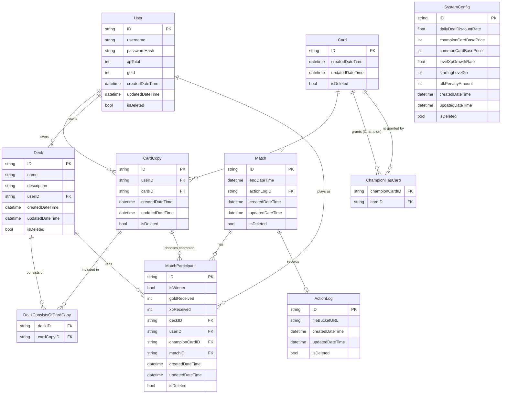

# API Implementation Plan

---

## 1. System Database ERD

Based on the system analysis documentation (`6. PhanTichThietKeHeThong.tex`), the database schema revolves around Users, their Card collection (CardCopy), Decks, Match records, and System configurations.

> [!NOTE]
> `Card` table is intentionally simplified on the backend. All heavy gameplay attributes (HP, Damage, Patterns) are stored purely on the Unity Client via `ScriptableObject`. The backend only uses `Card` IDs for economy and deck validation.

---

## 2. API Endpoints Specification

APIs will follow standard RESTful design, communicating via JSON. Authentication is required for all endpoints except `/auth`.

### 2.1 Authentication & User
Handles user registration, login, and fetching basic profile stats (Gold, XP).

* `POST /api/auth/register`
  * **Desc:** Creates a new user with minimum starting resources.
  * **Body:** `{"username": "player1", "password": "securepassword"}`
  * **Returns:** `{"token": "JWT_TOKEN", "user": {...}}`
* `POST /api/auth/login`
  * **Desc:** Authenticates a user.
  * **Body:** `{"username": "player1", "password": "securepassword"}`
  * **Returns:** `{"token": "JWT_TOKEN", "user": {...}}`
* `GET /api/users/me`
  * **Desc:** Gets current authenticated user's details (XP, Gold).
  * **Returns:** `{"ID": "u-123", "username": "player1", "xpTotal": 500, "gold": 1200}`

### 2.2 Collections (Cards)
Queries the player's card collection.

* `GET /api/collection/card-copies`
  * **Desc:** Gets all card copies owned by the user.
  * **Returns:** `[{"ID": "cc-1", "cardID": "card-lich", "createdDateTime": "..."}, ...]`

### 2.3 Decks
CRUD operations for building and managing decks.

* `GET /api/decks`
  * **Desc:** Gets all decks created by the user, including the array of `cardCopyID`s inside them.
  * **Returns:** `[{"ID": "d-1", "name": "Aggro Undead", "description": "...", "championCardID": "card-lich", "cardCopyIDs": ["cc-1", "cc-2"]}]`
* `POST /api/decks`
  * **Desc:** Creates a new deck.
  * **Body:** `{"name": "New Deck", "description": "...", "championCardID": "card-lich", "cardCopyIDs": ["cc-1", "cc-2"]}`
* `PUT /api/decks/{id}`
  * **Desc:** Updates an existing deck (name, cards). Validates that the user owns the `cardCopyIDs`.
* `DELETE /api/decks/{id}`
  * **Desc:** Deletes a deck (does NOT delete the cards).

### 2.4 Matches & History
Operations handling match results and replay logs.

* `GET /api/matches`
  * **Desc:** Retrieves the match history for the current user.
  * **Returns:** `[{"matchID": "m-1", "endDateTime": "...", "isWinner": true, "goldReceived": 50, "xpReceived": 100, "actionLogURL": "/static/logs/m-1.json"}]`
* `POST /api/matches/result` (Heavy Operation)
  * **Desc:** Submits the result of a match from the dedicated game server or authority client. This endpoint calculates XP/Gold gains based on `SystemConfig`, updates the `User` table, creates `Match` and `MatchParticipant` records, and saves the `ActionLog` to the bucket (mocked locally).
  * **Body:** `{"winnerUserID": "u-123", "loserUserID": "u-456", "winnerDeckID": "d-1", "loserDeckID": "d-2", "actionLogData": {...}}`

### 2.5 System Config
* `GET /api/config`
  * **Desc:** Returns the global system configuration for client calculations.
  * **Returns:** `{"dailyDealDiscountRate": 0.2, "levelXpGrowthRate": 1.5, ...}`

---

## 3. Python Test Backend Architecture (Part 2 Plan)

If approved, Part 2 will construct a Python backend inside `Assets/TestBE` using:
1. **FastAPI**: For high-performance, easy-to-read REST endpoints.
2. **PostgreSQL**: For the relational database, running via Docker.
3. **SQLAlchemy ORM**: To map Python classes to the Postgres ERD above.
4. **Docker Compose**: To orchestrate the FastAPI app and Postgres DB with one click.
5. **Mock Data Seeding**: On startup, a script will populate the DB so every user has at least 2 decks, 50 card copies, and 10 match histories. External bucket files will be mocked via static file hosting returning `.json` log files.

### Action Plan for Part 2:
- Write `docker-compose.yml`, `requirements.txt`, and `.env`.
- Write `models.py` matching the ERD.
- Write `main.py` with FastAPI endpoints.
- Write `seed.py` for DB mockup data.
- Write `.bat` files for `run-compose.bat` and `stop-compose.bat`.
