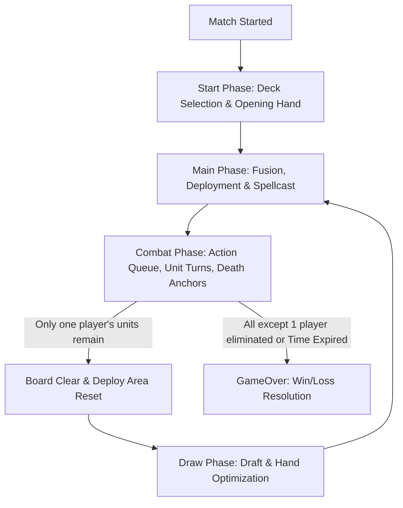

# Primora Chronicle Gameplay Phases Implementation Plan

This document outlines the detailed architecture for the pure Photon Fusion networked gameplay phases, including the state machines, data synchronization, and execution flow.

## 1. Networked Architecture (Pure Fusion)

To comply with the rulebook and network requirements, we will implement pure Photon Fusion `NetworkBehaviour` components. No complex subsystem architectures will be used. All state transitions, unit properties, and player stats are synchronized via Fusion `[Networked]` variables.

### Classes to Scaffold

1. `NetworkGameplayManager.cs` (under `Assets/_Game/Features/Gameplay/Scripts/GameState/`)
   - The authoritative game master.
   - Core states: `StartPhase`, `MainPhase`, `CombatPhase`, `DrawPhase`, `GameOver`.
   - Manages state timers, action queue for combat, phase transitions, and win/loss conditions.

2. `NetworkPlayerState.cs` (under `Assets/_Game/Features/Gameplay/Scripts/GameState/`)
   - Synchronizes player-specific data: `HP` (Champion HP), `IsAlive`, `HandCount`, `DeckCount`, `DiscardCount`.
   - Houses lists of active cards (Hand, Deck, Discard) using networked structures (e.g., Fusion arrays or RPCs).

3. `NetworkUnit.cs` (under `Assets/_Game/Features/Gameplay/Scripts/Combat/`)
   - Placed on deployed unit prefabs.
   - Synchronizes unit stats: `HP`, `MaxHP`, `Speed`, `DeathAnchor`, `HexRange`, `OwnerPlayerRef`, `Faction`.
   - Tracks dynamic fusions: 1 Troop + up to 4 EquipSpells.
   - Tracks skills, active cooldowns, status effects, and growth stacks for the Verdant Evolution chain.

4. `NetworkTileEffect.cs` (under `Assets/_Game/Features/Gameplay/Scripts/Board/`)
   - Tracks lingering tile effects (Corrupted, Seeded, Melting).
   - Replaces existing tile effects on the same tile.
   - Persists through board clear but does not tick duration or apply effects.

5. `CombatQueueManager.cs` (under `Assets/_Game/Features/Gameplay/Scripts/Combat/`)
   - Handles the sorting and ticking of unit turns during the Combat Phase.
   - Dynamically appends spawned persistent units (Verdant seedlings/saplings/treants/thorn colossuses).

## 2. Match Flow Transition Details

### Start Phase Details
- RPC to let players select pre-built deck (falls back to last deck on timeout).
- Champion cards shuffled in. HP = Champion HP.
- Draw opening hand of 6 cards.

### Main Phase Details
- Players can fuse exactly 1 Troop + up to 4 EquipSpells.
- A fully assembled unit is placed on Deploy Area.
- Play MainPhaseSpells.

### Combat Phase Details
- Sort units by Speed (Highest first, Speed tie -> lowest HP, tie -> coin toss).
- Unit turns: cooldowns tick down by 1. Move + 1 Action.
- Subtraction of `death_anchor` from owning player's HP on unit death. Checked continuously.

### Draw Phase Details
- Present 2 newly drawn cards. Hand management up to 6 cards. Excess cards discarded.
- Deck empty -> Discard pile shuffled into deck.

## 3. Scaffolding & Integration Plan
- Build all pure Photon Fusion classes.
- Ensure proper compilation under `GameplayFeatures.asmdef`.
- Attach scripts to appropriate prefabs under `Assets/_Game/Features/Gameplay/Prefabs`.
- Call "nircmd standby" on completion.
