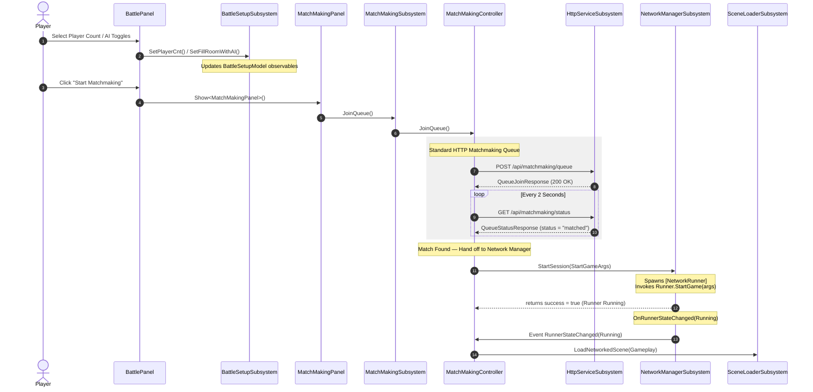

# Lobby to Matchmaking & Network Manager Flow

This document details the architectural flow, component boundaries, and event sequence coordinating the lobby setup, matchmaking queue, and Fusion networking lifecycle.

---

## 1. Responsibility Boundaries

```
┌───────────────────────────┐     ┌───────────────────────────┐     ┌───────────────────────────┐
│    BattleSetupSubsystem   │     │    MatchMakingSubsystem   │     │   NetworkManagerSubsystem │
├───────────────────────────┤     ├───────────────────────────┤     ├───────────────────────────┤
│ Configures:               │     │ Manages:                  │     │ Controls:                 │
│ - Player count            │     │ - Search Queue            │     │ - NetworkRunner Lifecycle │
│ - AI fill toggles         │     │ - HTTP Polling Loop       │     │ - Connection States       │
│ - Play mode options       │     │ - Confirmation phases     │     │ - Photon Fusion Callbacks │
└───────────────────────────┘     └───────────────────────────┘     └───────────────────────────┘
```

*   **[BattleSetupSubsystem](file:///d:/UnityProjects/DATN_PrimoraChronicle/Assets/_Game/Features/Lobby/Scripts/Battle/BattleSetupSubsystem.cs)**: Captures player selections ("What configuration does the user want?").
*   **[MatchMakingSubsystem](file:///d:/UnityProjects/DATN_PrimoraChronicle/Assets/_Game/Features/Lobby/Scripts/MatchMaking/MatchMakingSubsystem.cs)**: Coordinates queueing with the backend HTTP APIs, handles matchmaking states, and initiates networking ("How do we group players together?").
*   **[NetworkManagerSubsystem](file:///d:/UnityProjects/DATN_PrimoraChronicle/Assets/_Game/Core/Scripts/UI/SubSystem/Network/NetworkManagerSubsystem.cs)**: Interface/infrastructure for Photon Fusion ("How do we establish the low-level connection?").

---

## 2. Sequence Diagram of the Connection Flow



---

## 3. Detailed Phase Walkthrough

### Phase 1: Setup & Configuration (Battle Room)
1. **Selection Input**: The user interacts with dropdowns or toggles in [BattlePanel.cs](file:///d:/UnityProjects/DATN_PrimoraChronicle/Assets/_Game/Features/Lobby/Scripts/Battle/BattlePanel.cs).
2. **Subsystem Update**: On change, the panel invokes methods on the [BattleSetupSubsystem](file:///d:/UnityProjects/DATN_PrimoraChronicle/Assets/_Game/Features/Lobby/Scripts/Battle/BattleSetupSubsystem.cs):
    ```csharp
    _battleSetup.SetPlayerCnt(playerCnt);
    _battleSetup.SetFillRoomWithAI(isFillRoom);
    ```
3. **Model Mutation**: `BattleSetupSubsystem` delegates calls to `BattleSetupController`, updating the observables inside `BattleSetupModel`:
    ```csharp
    private Observable<bool> _fillRoomWithAI = new(false);
    private Observable<int> _playerCnt = new(2);
    ```

### Phase 2: Entering Matchmaking
1. **Panel Open**: Clicking `StartMatchmaking` triggers:
    ```csharp
    await _uiManager.Show<MatchMakingPanel>();
    ```
2. **Queue Request**: In [MatchMakingPanel.cs](file:///d:/UnityProjects/DATN_PrimoraChronicle/Assets/_Game/Features/Lobby/Scripts/MatchMaking/MatchMakingPanel.cs), clicking `_findMatchButton` calls:
    ```csharp
    private void OnFindMatch() => _matchMaking.JoinQueue();
    ```
3. **Queue Initialized**: [MatchMakingController.cs](file:///d:/UnityProjects/DATN_PrimoraChronicle/Assets/_Game/Features/Lobby/Scripts/MatchMaking/MatchMakingController.cs) starts the matchmaking loop, updating the local matchmaking model state to `Searching`:
    ```csharp
    _model.ApplyState(new MatchMakingStateData {
        Phase  = MatchMakingPhase.Searching,
        Status = "Finding opponent..."
    });
    ```

### Phase 3: Backend Matching Loop
1. **Queue POST**: The client informs the matchmaking backend server of the queue request:
    ```csharp
    var response = await _http.Post<QueueJoinResponse, object>(
        "/api/matchmaking/queue", new { userID = _authSession.UserId });
    ```
2. **Status Polling**: If successful, a polling loop is initiated using a `CancellationTokenSource`:
    ```csharp
    _pollingCts = new System.Threading.CancellationTokenSource();
    _ = PollForMatch();
    ```
3. **Match Confirmation**: The client loops `GET /api/matchmaking/status`. When the server responds with `{ "status": "matched", "session_name": "..." }`, the loop terminates.

### Phase 4: Low-Level Connection Handoff
1. **Configuration Creation**: The matchmaking controller fetches parameters from [BattleSetupSubsystem](file:///d:/UnityProjects/DATN_PrimoraChronicle/Assets/_Game/Features/Lobby/Scripts/Battle/BattleSetupSubsystem.cs) and creates `StartGameArgs`:
    ```csharp
    var args = new StartGameArgs
    {
        GameMode    = GameMode.Client,
        SessionName = sessionName,
    };
    ```
2. **Session Start**: It commands the Network Subsystem to spin up Fusion:
    ```csharp
    bool success = await _networkManager.StartSession(args);
    ```
3. **Runner Construction**: Inside [NetworkManagerController.cs](file:///d:/UnityProjects/DATN_PrimoraChronicle/Assets/_Game/Core/Scripts/UI/SubSystem/Network/NetworkManagerController.cs), the runner is instantiated, initialized with defaults, and started:
    ```csharp
    var go = new GameObject("[NetworkRunner]");
    Runner = go.AddComponent<NetworkRunner>();
    go.AddComponent<NetworkSceneManagerDefault>();
    Runner.ProvideInput = !Application.isBatchMode;
    Runner.AddCallbacks(this);
    
    var result = await Runner.StartGame(args);
    ```

### Phase 5: Scene Transition & Game Start
1. **State Mutation**: Once `StartGame` yields successfully, the model state shifts:
    ```csharp
    _model.SetRunnerState(NetworkRunner.States.Running);
    ```
2. **Event Dispatch**: The model observable triggers `RunnerStateChanged` on [NetworkManagerSubsystem.cs](file:///d:/UnityProjects/DATN_PrimoraChronicle/Assets/_Game/Core/Scripts/UI/SubSystem/Network/NetworkManagerSubsystem.cs).
3. **Controller Interception**: [MatchMakingController.cs](file:///d:/UnityProjects/DATN_PrimoraChronicle/Assets/_Game/Features/Lobby/Scripts/MatchMaking/MatchMakingController.cs) intercepts the event and executes the networked scene load:
    ```csharp
    private void HandleRunnerStateChanged(NetworkRunner.States state)
    {
        if (state == NetworkRunner.States.Running)
        {
            _model.ApplyState(new MatchMakingStateData
            {
                Phase  = MatchMakingPhase.Connected,
                Status = "Connected!"
            });
            _sceneLoader.LoadNetworkedScene(_networkManager.Runner, SceneNames.GAMEPLAY);
        }
    }
    ```
