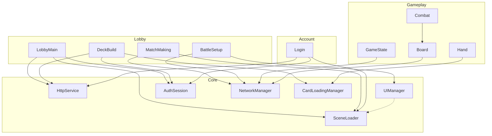

# Subsystem Architecture & Dependency Map

This document outlines the architectural structure of the `DATN_PrimoraChronicle` project, focusing on the Subsystem-Controller-Model pattern and the inter-dependencies between core and feature systems.

## 1. Architectural Pattern
Every subsystem follows a strict **MVC (Model-View-Controller)** pattern managed via **Zenject Dependency Injection**:
- **Subsystem (Facade):** The public interface and entry point. It wraps the controller's logic and exposes the model's data via observable events.
- **Controller:** Contains the business logic and handles "Intents" (actions). It is the only component allowed to modify the Model.
- **Model:** Stores the state. It uses `UnityObservables` to notify subscribers of changes.
- **Panel (View):** UI components (MonoBehaviour) that inject the Subsystem to display data and trigger actions.

---

## 2. Core Subsystems (Foundation)
Core subsystems provide global services used by almost all feature-level systems.

| Subsystem | Description | Dependencies (Internal/External) |
| :--- | :--- | :--- |
| **UIManager** | Manages UI panel lifecycle, layers (HUD, POPUP, SCREEN), and transitions. | `UIMappingSO`, `DiContainer`, `SceneContextRegistry` |
| **HttpService** | Handles async HTTP requests (GET, POST, PUT) to the ASP.NET Backend. | `IHttpServiceModel` |
| **AuthSession** | Manages JWT tokens, user IDs, and persistent login state. | `IAuthSessionModel` |
| **CardLoadingManager** | Resolves card data from GDS JSON and loads visual assets from Addressables. | `ICardLoadingManagerModel` |
| **NetworkManager** | Manages Photon Fusion 2 `NetworkRunner` lifecycle and session connectivity. | `INetworkManagerModel` |
| **SceneLoader** | Handles scene transitions and loading screen overlays. | `IUIManagerSubsystem` |
| **AudioManager** | Controls background music (BGM) and sound effects (SFX) volumes. | `IAudioManagerModel` |

---

## 3. Feature Subsystems (Business Logic)

### Account Feature
| Subsystem | Panel | Description | Dependencies |
| :--- | :--- | :--- | :--- |
| **Login** | `AccountLoginPanel` | Authenticates user via backend and stores session. | `HttpService`, `AuthSession`, `SceneLoader` |
| **Register** | `AccountRegisterPanel` | Handles new account creation and returns to login. | `HttpService`, `UIManager` |

### Lobby Feature
| Subsystem | Panel | Description | Dependencies |
| :--- | :--- | :--- | :--- |
| **LobbyMain** | `LobbyMainPanel` | Main dashboard displaying User Stats (XP, Gold, Username). | `HttpService`, `AuthSession`, `SceneLoader` |
| **Deck** | `DeckPanel` | Displays a list of player-created decks. | `HttpService`, `AuthSession` |
| **DeckBuild** | `DeckBuildPanel` | Complex editor for creating/modifying decks (20 cards + 1 Champion). | `HttpService`, `CardLoadingManager`, `AuthSession` |
| **Shop** | `ShopPanel` | Interface for purchasing Card Copies using Gold. | `HttpService` |
| **Profile** | `ProfilePanel` | Detailed view of player statistics and level progress. | `HttpService`, `AuthSession` |
| **MatchMaking** | `MatchMakingPanel` | Communicates with NetworkManager to find opponents. | `NetworkManager`, `SceneLoader` |
| **MatchHistory** | `MatchHistoryPanel` | Lists previous match outcomes and rewards (XP/Gold). | `HttpService`, `AuthSession` |
| **BattleSetup** | `BattlePanel` | Configures match parameters (Offline/Online, Bot count). | `NetworkManager`, `UIManager` |
| **Setting** | `SettingPanel` | Manages audio volumes and game configurations. | `AudioManager` |

### Gameplay Feature (Networked)
These subsystems utilize the **Networked Subsystem Pattern** where state is synchronized via Photon Fusion.

| Subsystem | Role | Description | Dependencies |
| :--- | :--- | :--- | :--- |
| **GameState** | Authority | Manages the core game loop (Draw, Fuse, Combat, End phases). | `NetworkManager` |
| **Board** | Simulation | Manages the hexagonal grid and placement of units. | `NetworkManager` |
| **Combat** | Resolution | Calculates damage resolution based on attack patterns. | `BoardSubsystem` |
| **Hand** | Local/Net | Manages the cards currently held by the local player. | `CardLoadingManager` |
| **DrawPhase** | Transition | Handles card distribution at the start of a turn. | `HttpService`, `HandSubsystem` |

---

## 4. Dependency Visualization

---

## 5. Panel Index
| Panel Name | File Location | Subsystem Association |
| :--- | :--- | :--- |
| `AccountLoginPanel` | `Features/Account/Scripts/Login/AccountLoginPanel.cs` | `AccountLoginSubsystem` |
| `AccountRegisterPanel` | `Features/Account/Scripts/Register/AccountRegisterPanel.cs` | `AccountRegisterSubsystem` |
| `LobbyMainPanel` | `Features/Lobby/Scripts/LobbyMain/LobbyMainPanel.cs` | `LobbyMainSubsystem` |
| `DeckBuildPanel` | `Features/Lobby/Scripts/DeckBuild/DeckBuildPanel.cs` | `DeckBuildSubsystem` |
| `ShopPanel` | `Features/Lobby/Scripts/Shop/ShopPanel.cs` | `ShopSubsystem` |
| `MatchMakingPanel` | `Features/Lobby/Scripts/MatchMaking/MatchMakingPanel.cs` | `MatchMakingSubsystem` |
| `ProfilePanel` | `Features/Lobby/Scripts/Profile/ProfilePanel.cs` | `ProfileSubsystem` |
| `MatchHistoryPanel` | `Features/Lobby/Scripts/MatchHistory/MatchHistoryPanel.cs` | `MatchHistorySubsystem` |
| `BattlePanel` | `Features/Lobby/Scripts/Battle/BattlePanel.cs` | `BattleSetupSubsystem` |
| `SettingPanel` | `Features/Lobby/Scripts/Setting/SettingPanel.cs` | `SettingSubsystem` |
